# Case for the Pi1541

3D-printed parts for the Pi1541.

## Introduction

I designed several 3D-printed parts for my Pi1541.
I used these names: bottom, top, front and foot for the outside parts,
and OLED-holder, button-extender, standoff11hx6x3, standoff4hx6x2.5 for 
the inside parts.

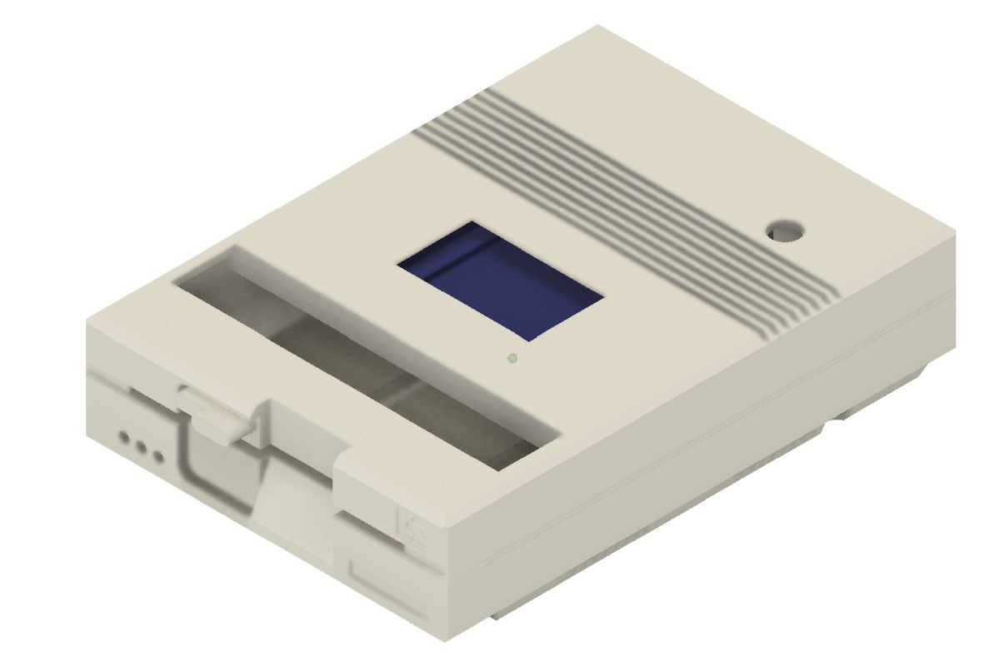

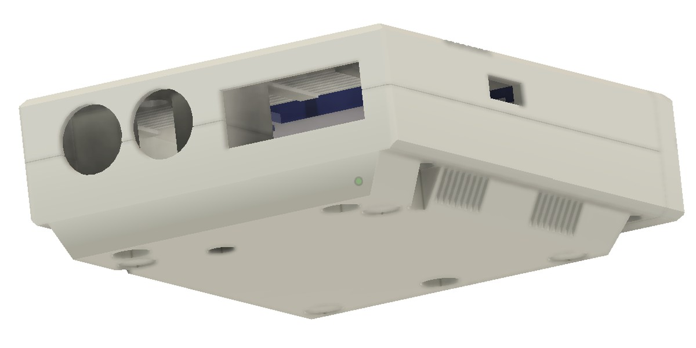

## Outside

Here is an overview of the outside parts.

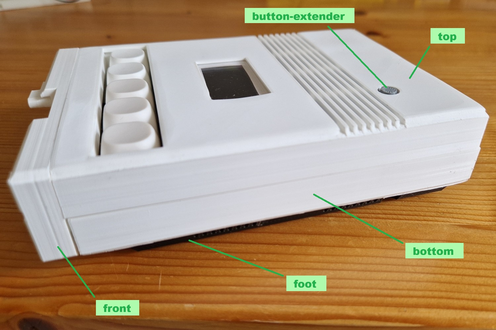

- [bottom stl file](bottom.stl)  
  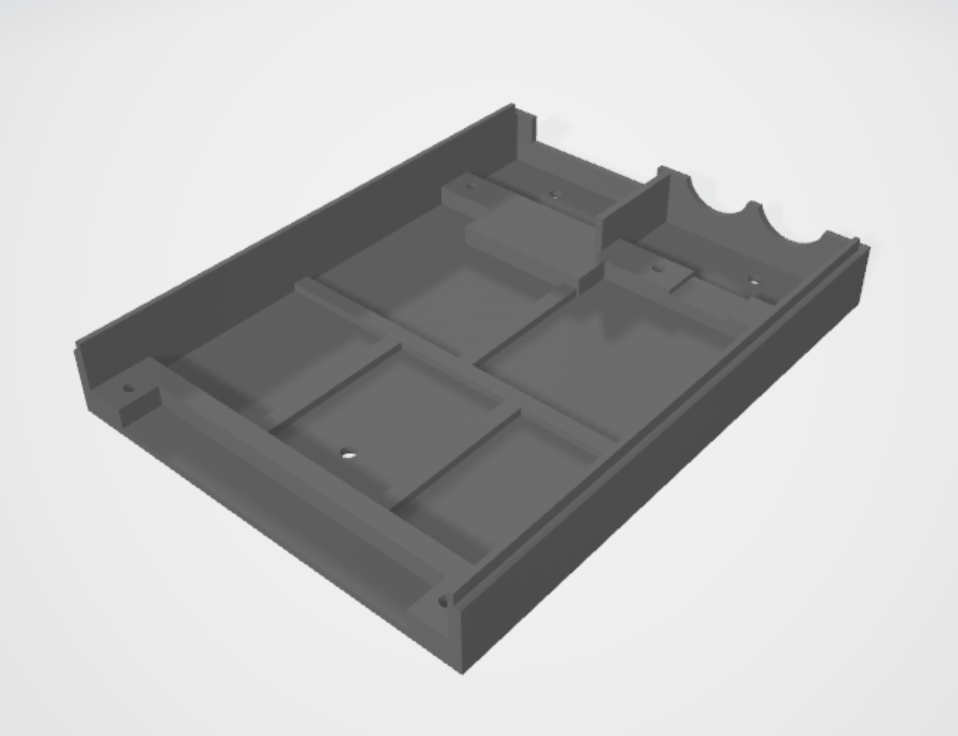

- [top stl file](top.stl)  
  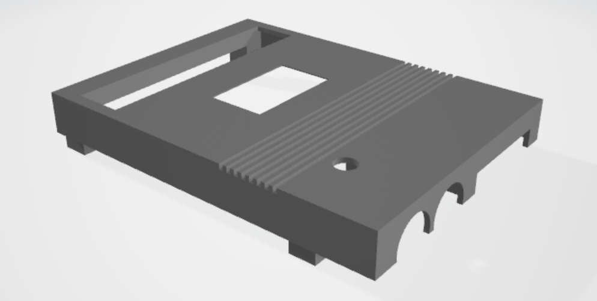

- [front stl file](front.stl)  
  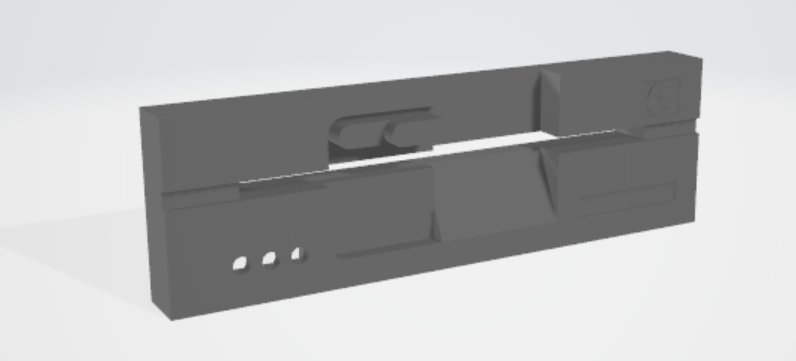

- [foot stl file](foot.stl)  
  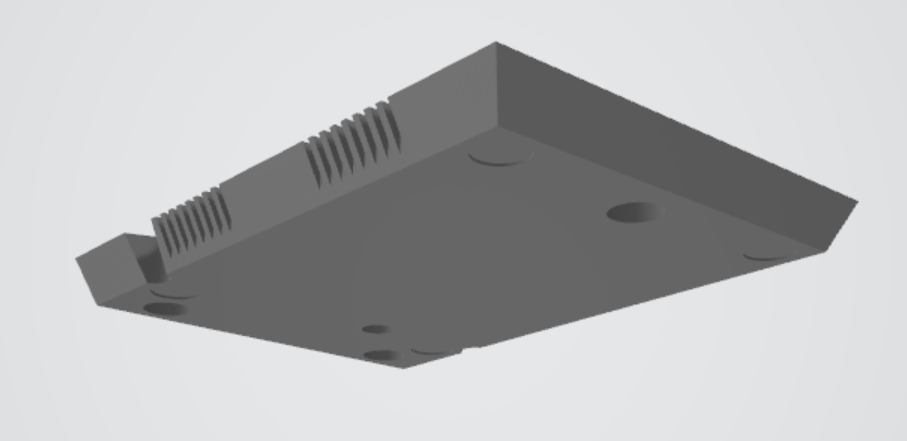

## Inside

Here is an overview of the inside parts.

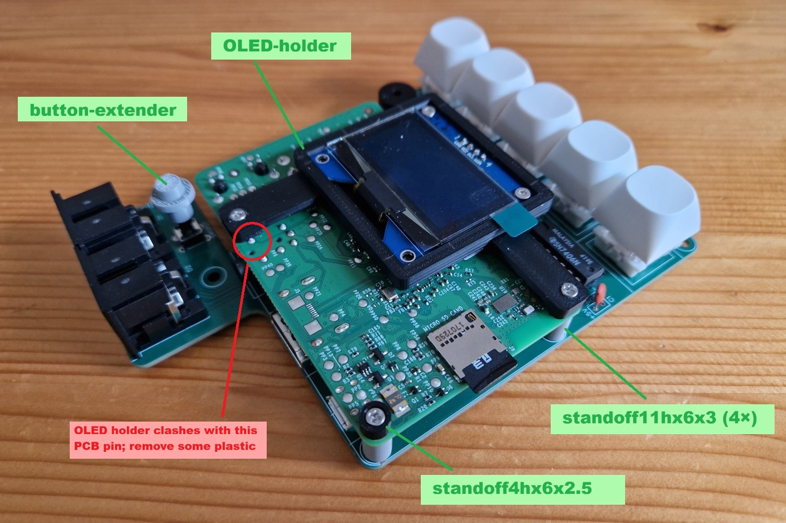

- [OLED-holder stl file](OLED-holder.stl)  
  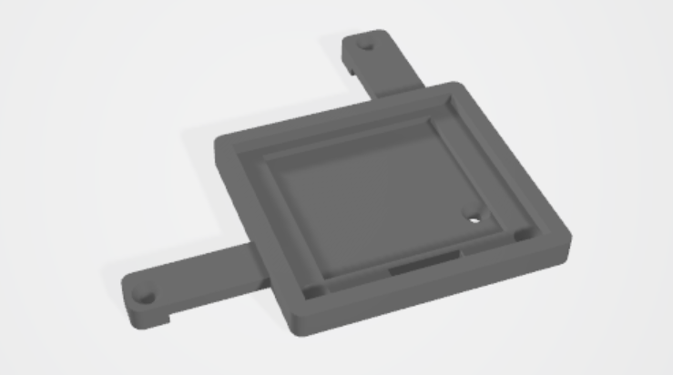

- [button-extender stl file](button-extender.stl)  
  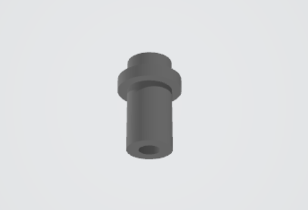

- [standoff11hx6x3 stl file](standoff11hx6x3.stl) (needed four times)  
  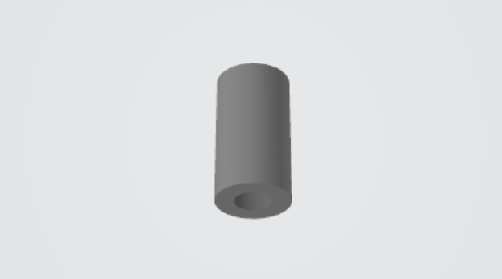

- [standoff4hx6x2.5 stl file](standoff4hx6x2.5.stl)  
  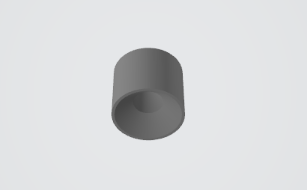

(end)
