# PCB

The PCB design files for my Pi1541.

See the [main project page](https://github.com/maarten-pennings/pi1541device#my-design) 
for high level design choices.

## Sources

I designed the schematics and layout with [EasyEDA](https://easyeda.com/).

### Schematics

The schematics as [EasyEDA json](pi1541-schem.json) 
or as [pdf](pi1541-schem.pdf).

### Layout

The layout as [EasyEDA json](pi1541-pcb.json) 
or as [front pdf](pi1541-pcb-front.pdf) or [back pdf](pi1541-pcb-back.pdf).

### Gerber

The [gerber](pi1541_gerber.zip) file for [JLCPCB](https://jlcpcb.com/DMP).

## Renders

### Renders of the bare PCB

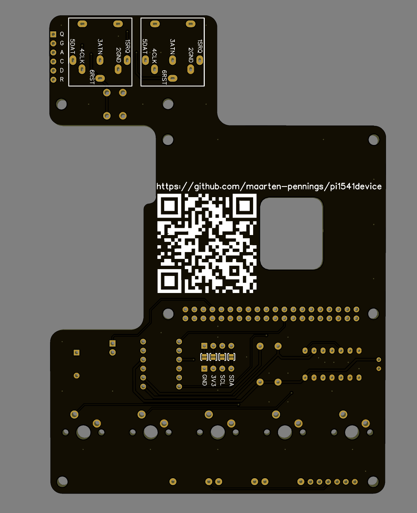

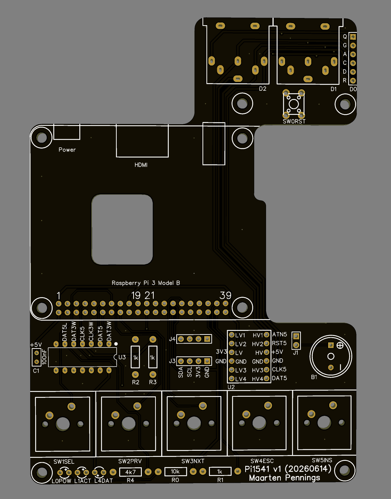

### Renders of assembled PCB

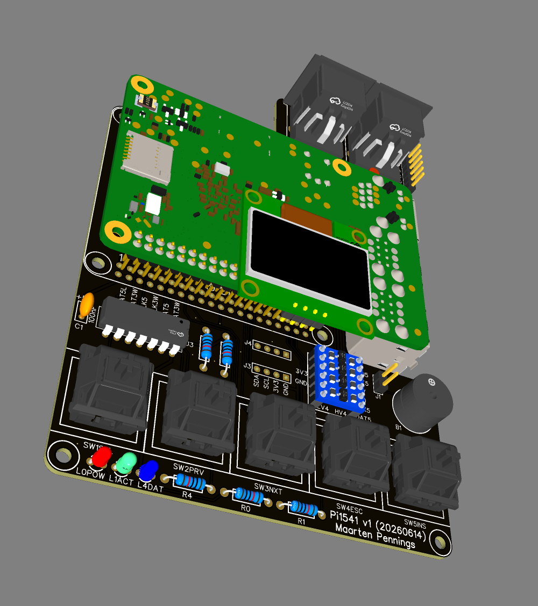

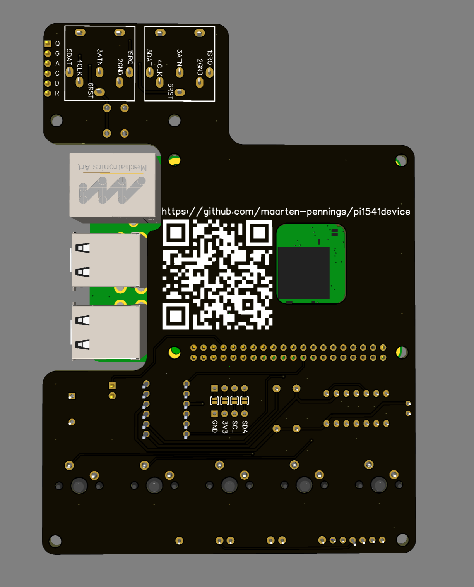

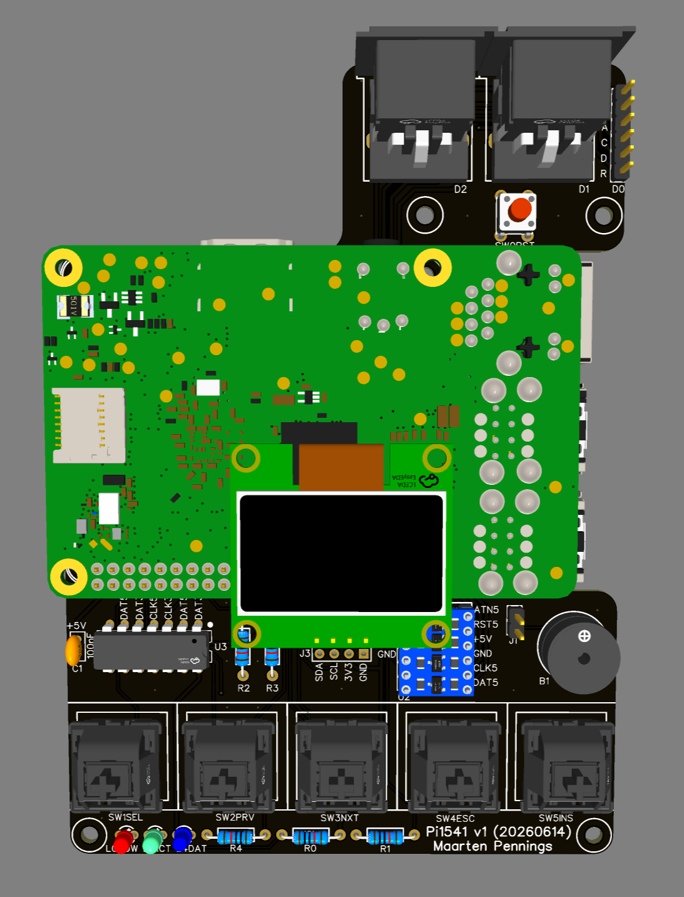

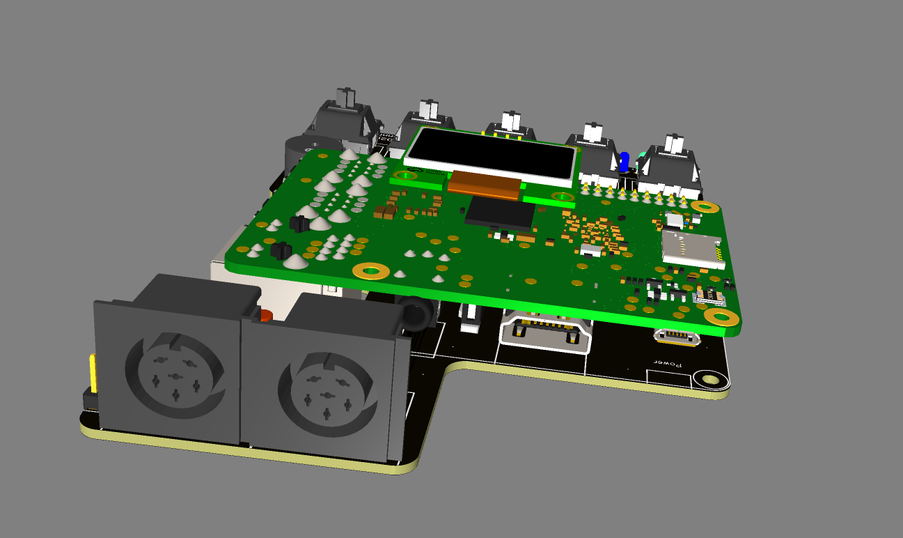

## Gallery

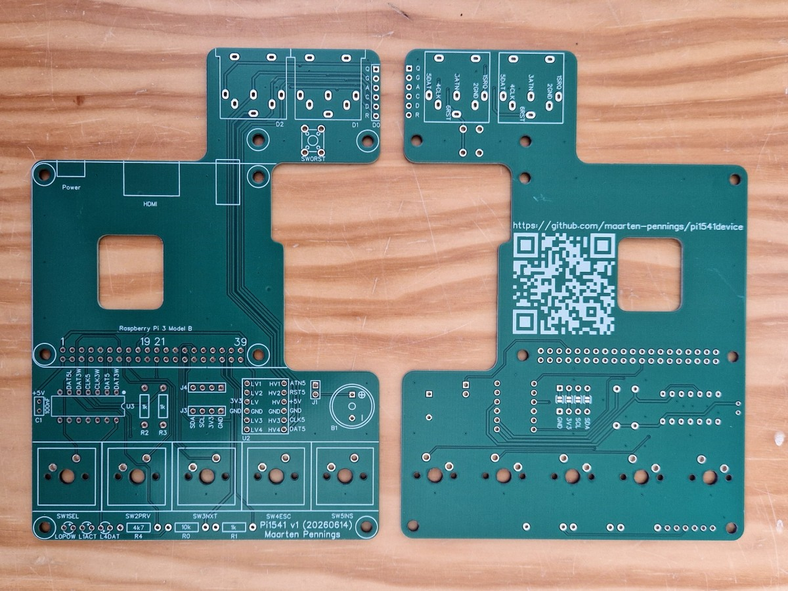

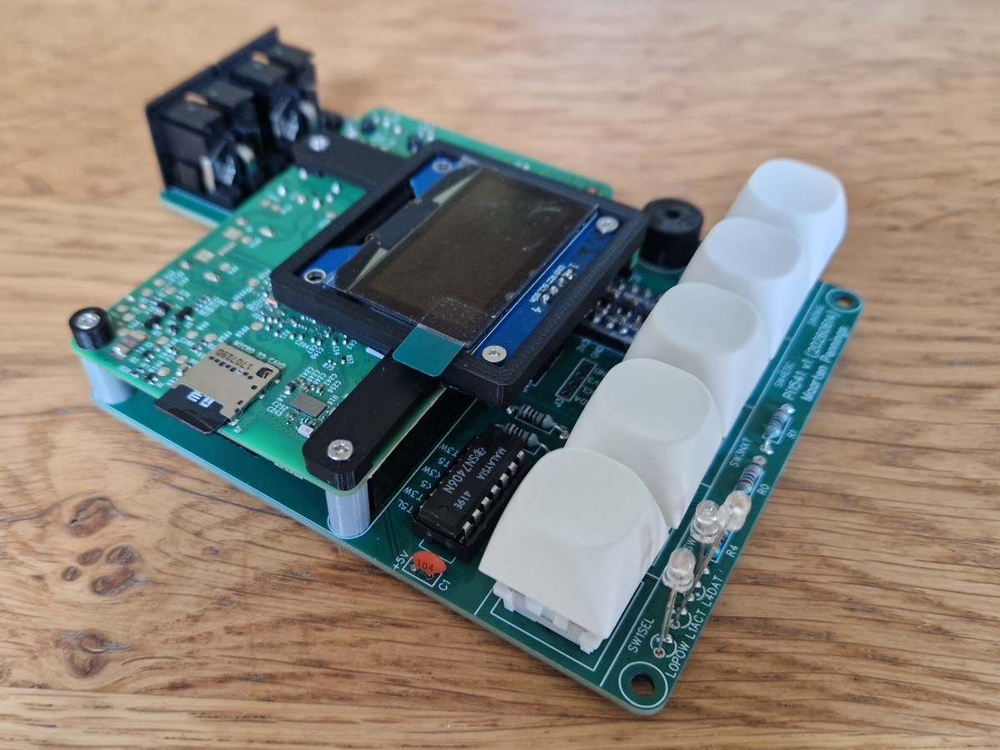

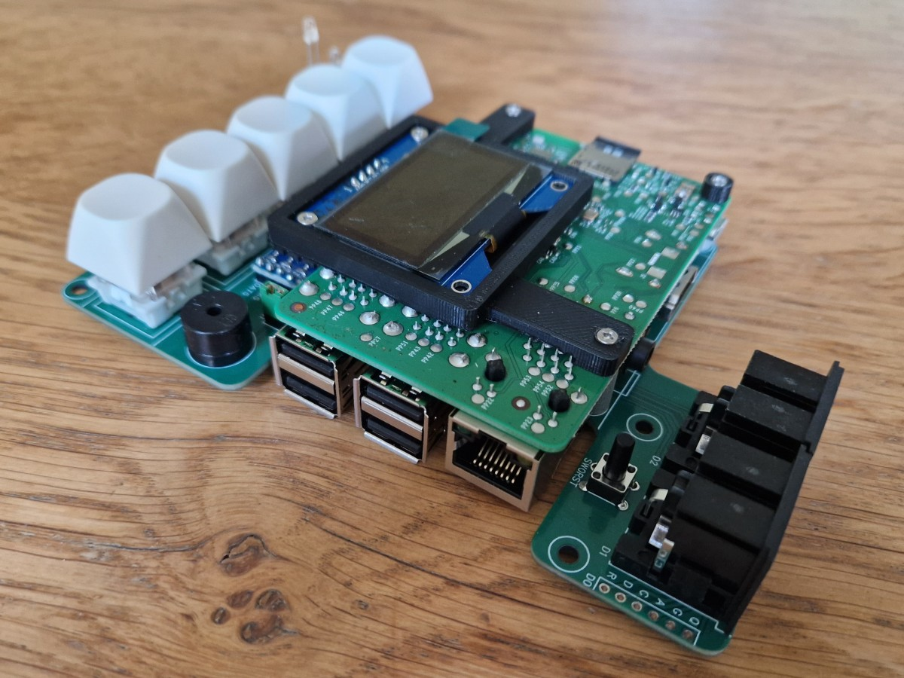

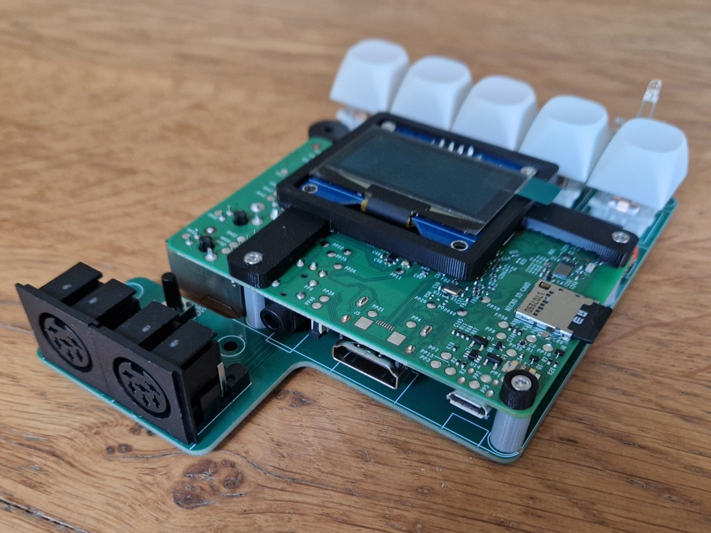

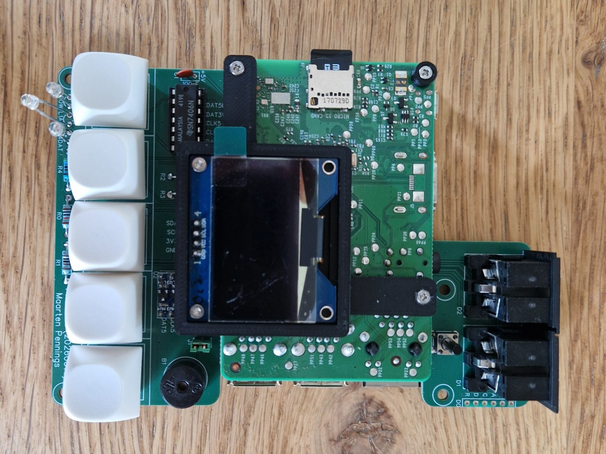

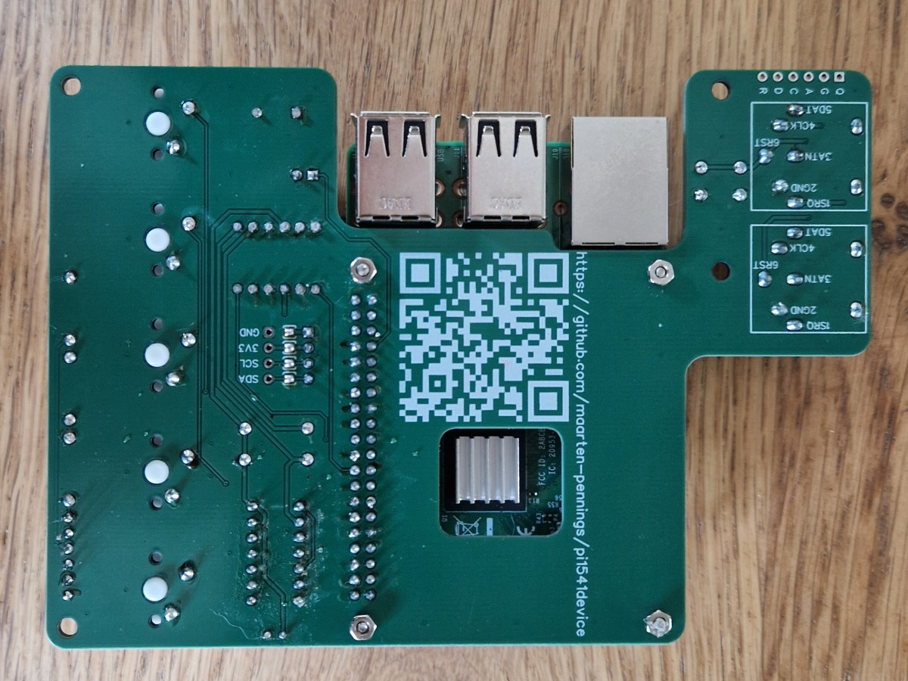

(end)
