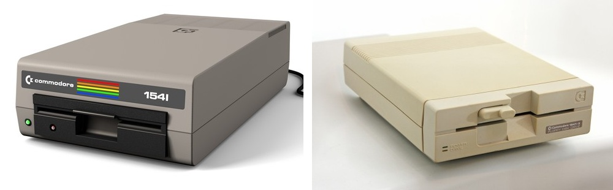
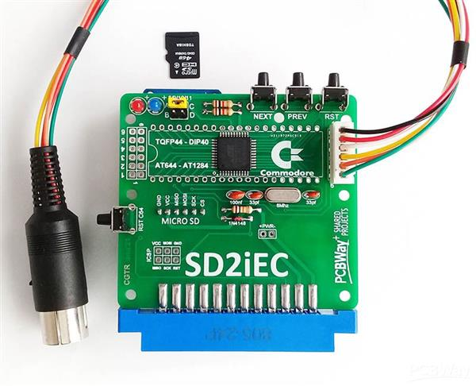
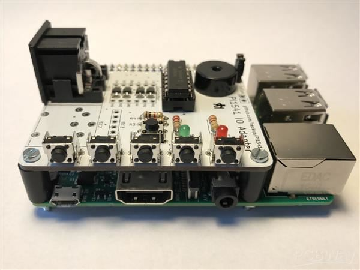
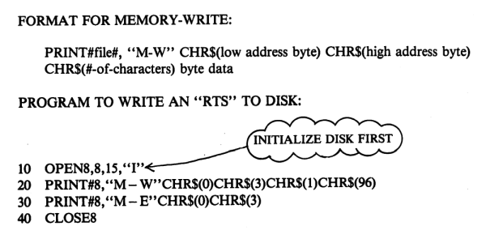

# Pi1541

My take on the Pi1541, the cycle exact Commodore 1541 disk drive emulator that runs on a Raspberry Pi.

## Introduction

The _Commodore 1541_ is a 5.25-inch floppy disk drive.
It was _the_ solution for file storage when working with Commodore 64 (C64). 
Over the decades the drives and floppy disks degraded.
Various disk drive replacements where developed. 
One of them is the _Pi1541_, the topic of this repo.

> 
>
> _Commodore 1541 from [Commodore online museum](https://cbmmuseum.kuto.de/floppy_vc1541.html)_

An important predecessors of the Pi1541 was the 
[SD2IEC](https://www.c64-wiki.com/wiki/SD2IEC). The SD2IEC 
contains an ATmega644 microcontroller from Atmel that 
translates Commodore serial bus (IEC) commands into FAT 
file system operations on the SD card. This allows the C64 
to access files on an SD card.

> 
>
> _Example SD2IEC project from [PCBWAY](https://www.pcbway.com/project/shareproject/SD2iEC_COMMODORE_64_DISK_DRIVE_EMULATOR_POWERED_from_USER_PORT_MICRO_SD_VERSI_c56a9f83.html)_

The SD2IEC is low-cost and capable to store about 25000 floppies
(of 170 kByte each) on a 4GB SD card. It is small and can be powered 
by the C64 itself (usually via the user port). 
The big drawback is that while the SD2IEC is compatible
with the _file level commands_, it cannot handle the _programming commands_ 
given via the secondairy channel 15.

Unfortunately, due to the low-speed of the 1541, many commercial games, demos, 
and developer cartridges come with their own fastloaders. Part of a fastloader 
is software that is uploaded to the 1541 drive (which is a 6502 based 
computer on its own) via the above mentioned programming commands. 
The SD2IEC cannot run that uploaded software.
This results in low software compatibility: a large portion of the C64 
applications (games) will not load from an SD2IEC.

The Pi1541, developed by Steve White, solved this. Instead of the 
ATmega644, it uses a Raspberry Pi and a small add-on (a so-called "HAT"). The Pi is 
powerful enough to provide a cycle-exact hardware emulation of the real 
Commodore 1541 drive. It emulates the drive's internal 6502 CPU, the RAM, 
and the VIA chips down to the exact clock cycle. You even need to download the 
original Commodore ROM image of the 1541 to "program" this virtual 6502.

> 
>
> _Example Pi1541 project from [PCBWAY](https://www.pcbway.com/project/shareproject/Pi1541_IO_Adapter__Rev_2.html)_

This solution provides near 100% compatibility because it behaves exactly 
like the original drive. It supports complex copy protections and almost every 
fastloader ever written (e.g., JiffyDOS, Final Cartridge III).

Steve White wrote a "bare metal" application on the Pi. This means his 
emulator does not run under Raspberry Pi OS (Linux) but directly on the 
Broadcom BCM2837B0. This results in fast booting, and carefree switching off 
the power. On the down side, the Pi1541 is more expensive than the SD2IEC due to the 
Raspberry Pi board; it is a bit bigger physically; and needs (more) external power.
But most believe these down sides are well compensated by the extra compatibility.

## Concepts

This section explains the key concepts: current working directory, 
three categories of commands, the new `CD` command, mounting `.64` as
virtual floppy, the problem with the "programmers commands", and finally 
_browse mode_ and _emulation mode_.

### Current working directory

The Pi1541 contains an SD card, and it maintains a notion of the 
_current working directory_ on that SD card. Its firmware bridges the 
commands that come from the C64 (over the IEC bus) to the FAT file system 
on the SD card. 

It does understand the "high level command" such as 
`SAVE "MYGAME"`, `LOAD "MYGAME"`, and even `LOAD "$"` to read the 
(current working) directory. The `SAVE "MYGAME"` creates a file `MYGAME` 
on the SD card, in the current working directory. Similarly `LOAD "MYGAME"` 
reads the file `MYGAME` from the current working directory and sends it back 
to the C64 over the IEC bus. It will be no surprise that `LOAD "$"` reads 
the current working directory and sends that back to the C64.

### Commands 

If you are more than a casual user of the C64 and the 1541 drive, 
you will know that next to those "high level commands" there are more 
"advanced commands" that a 1541 will understand. 
The Pi1541 also emulates those. For example `OPEN 1,8,15,"S0:MYGAME":CLOSE 1` 
scratches (deletes) the file `MYGAME` from the current working directory, 
and `OPEN 1,8,15,"R0:YOURGAME=MYGAME":CLOSE 1` renames `MYGAME` to `YOURGAME`.

Recall that the DOS (disk operating system) was not part of the C64 
(would have taken to much memory), rather it was baked into the 1541 itself.
What is part of the C64, is setting up a "data pipe" (open a file) and send 
the (textual) command over that pipe. That is the reason we have adcanced commands 
(eg see [c64-wiki](https://www.c64-wiki.com/wiki/Commodore_1541#Disk_Drive_Commands)).

### CD 

You might be wondering how to _change_ the current working directory. 
The developers of the SD2IEC added an advanced command: `CD`. For example 
`OPEN 1,8,15,"CD:SUBDIR":CLOSE 1` changes the current working directory 
to subdirectory `SUBDIR` assuming that directory exists in the current 
working directory. The command `OPEN 1,8,15,"CD:←":CLOSE 1` (the `←` being 
the key in the upper left corner on the C64 keyboard) moves back to the 
parent directory. No idea why they did not pick the standard `..` instead 
of the rather obscure `←`. Next to `CD`, related "advanced commands" were 
added: `MD` to make a directory and `RD` to remove an (empty) directory.

Of course the C64 doesn't know about the `CD` command, but you as operator 
can issue them and the new directory feels like a new disk to the C64. 
Typically the SD2IEC and the Pi1541 also come with a file browser `FB64`. 
This browser does know the `CD` command and allows easy navigation through 
the file system on the SD card.

### Mounting a virtual floppy 

There is one more important concept. In the C64 retro community, floppy disks are ripped 
to a single file. They have the extension `.d64` and are useable as virtual disk in tools 
like VICE, the C64 Ultimate, and also the SD2IEC and Pi1541. 

SD2IEC and Pi1541 treat `.d64` files a bit like 
Windows treats `.zip` files. It is one _file_, but you can `CD` 
into it, and that "unzipped" `.64` file is then the "mounted" _directory_. All 
"high level commands" (`LOAD`) work on the mounted floppy, and so do all 
"advanced commands" (`S0:MYGAME`). Even `OPEN 1,8,15,"CD:←":CLOSE 1` works;
it unmountes the `.64` virtual floppy and switches to its containing directory.
Of course `OPEN 1,8,15,"CD:SUBDIR":CLOSE 1` does not work in the mounted `.64` because
`.d64` files are supposed to be ripped 1541 disks, and the 1541 did not have a notion 
of subdirectories.

### Programmer's commands 

We should realize that the firmware (of SD2IEC and Pi1541) sees the high 
level and advanced commands come in via the IEC bus. They need to parse and 
understand them, and then execute them. That is the task for the software written 
by the programmers of those two devices. That is development work.

Unfortunately, next to the high level and advanced commands there is a third 
category, the "programmer's commands". Chapter 8 of the 1541 
[user manual](https://www.zimmers.net/anonftp/pub/cbm/manuals/drives/1541_Users_Guide.pdf) 
introduces these with the text "The expert programmer can actually design routines 
that reside and operate on the disk controller". This is with commands such as `M-W` 
(memory write), `M-R` (memory read), and `M-E` (memory execute). Here is 
an example from the manual (recall that `RTS` has opcode 0x60 or 96 decimal).

> 
>
> Example of Programmer's commands from the 
> [user manual](https://www.zimmers.net/anonftp/pub/cbm/manuals/drives/1541_Users_Guide.pdf)

### Browse mode versus emulation mode

So far SD2IEC and Pi1541 are very similar. Now we come to an important difference.
The SD2IEC does not implement the programmer's commands, but Pi1541 does.
In a clever way.

The Pi1541 has two modes. The developer, Steve White, calls them _browse mode_ and
_emulation mode_. We could say that the SD2IEC only supports browse mode, and Pi1541 
supports both. When the Pi1541 starts, it is in browse mode. In browse mode, the 
firmware from Steve runs. This firmware implements the high level and advanced 
commands _including the `CD` command_. This allows all existing tools to 
browse all files on the SD card. As soon as a command comes in that `CD`s into 
a virtual floppy disk (I called this "mounting the floppy" above), the Pi1541 
switches to emulation mode. In emulation mode the Raspberry Pi _emulates the 1541_.

The emulation is serious. A real 1541 contains a 6502,
RAM, ROM, and VIAs. The Pi1541 emulates all of those, to the cycle. What code does 
the emulated 6502 run? The original 1541 ROM from Commodore that you have to download 
and put on the SD card - Steve can't do that due to licensing reasons. This means that 
all `M-W` and `M-E` commands are working, they are part of that 1541 rom. And 
software that is uploaded and executed this way by the fastloaders also just works, 
it doesn't know the 1541 is emulated.

In emulation mode, an `OPEN 1,8,15,"CD:←":CLOSE 1` is intercepted, unmounts the `.d64`, 
sets the working directory to the parent, and switches back to browse mode.

It is important for a user to know about these two modes, and to know which one is 
running when. For example, the advanced command `OPEN 1,8,15,"N0:DISKNAME,DN":CLOSE 1`
(recall `N` stands for `NEW` or rather format) in _browse_ mode just _creates_ a 
new, empty, formated virtual floppy with the name `DISKNAME.d64`. If you give 
the same command in emulation mode, the original 1541 firmware kicks in, 
and it will hapily wipe (format) the entire mounted `.d64` virtual floppy.

### My additions

Mostly for fun, I have made a couple of additions to Steve's firmware. The `CD:subdir` command 
goes one subdirectory down, and `CD:←` goes one up. For some reason the `CD://` did not 
work. It is supposed to go to the root directory (yes with two slashes, something to 
do with multiple volumes). I fixed it. Secondly, I was missing a `pwd` command (print 
working directory). I added a `LOAD "$$"` command that does that. I added both in 
[v1.27](https://github.com/maarten-pennings/Pi1541#additions-in-this-fork).

### Real life operation

You might be wondering how the Pi1541 works in real life. 
You can do those `CD` commands combined with `LOAD "$"` by hand,
or let `FB64` do them for you. 

But the Raspberry Pi can also be connected to a full keyboard and HDMI screen. 
The HDMI screen will always shows the current directory and its contents, 
also when it is changed with `CD` (or `FB64` doing `CD`s).
It is even possible to change the current directory with the full keyboard 
connected to the Raspberrry Pi. 

There is a third option. We can connect an OLED and five buttons 
(Next, Prev, Select, Back and one for swap lists) to the Pi. 
The OLED will also always show the current directory 
(in sync with the HDMI screen), and the buttons also allow browsing 
(just like the full keyboard).

Three methods, always in sync.

Oh, and in [v1.25](https://github.com/maarten-pennings/Pi1541#additions-in-this-fork)
I added support for a bigger (1.54") OLEDs.

## Setup SD card

### Step 1

Format SD card to FAT32

### Steps 2, 3, 4

It seems that on a Raspberry Pi (up to version 3), the GPU takes care of the boot process.
When the Raspberry Pi powers on, the bootloader burned directly into the hardware (ROM) wakes up. 
It only knows how to look for a file named `bootcode.bin` on an SD card with FAT16 or FAT32.
We get boot files from [raspberrypi's GitHub](https://github.com/raspberrypi/firmware).

- The Bootloader `bootcode.bin` (50 kbyte). 
  This is the first code the Raspberry Pi’s GPU reads from the SD card (into the GPU's cache).
  It initializes the memory and prepares the system to load the GPU firmware.

- The GPU firmware `start.elf` (3 Mbyte) is the "operating system" for the GPU. 
  It reads `config.txt`, sets up the clocks, configures the display/HDMI, splits the RAM between the GPU and the CPU. 
  Finally, it loads your bare-metal binary `kernel.img` into RAM, and releases the ARM CPU from reset so it starts executing code.

- The memory map `fixup.dat` (7 kbyte) is a companion to `start.elf`.
  It contains configuration data partitioning the RAM between the GPU and the CPU, read by `start.elf`.

### Step 5

We get the real firmware from [Pi1541.zip](https://cbm-pi1541.firebaseapp.com/Pi1541.zip).

- The firmware `kernel.img` (500 kbyte).
  In the Raspberry Pi, the filename `kernel.img` is the default name the GPU (`start.elf`) 
  looks for to start the main processor (ARM CPU). It usually points to the Linux kernel but it can 
  be any compiled binary. The _Pi1541_ is a bare metal firmware. This means that the code runs
  directly on the hardware without an underlying operating system (no scheduler, no file system).

  I did not takes latest greatest, which was 1.24, but 1.23, because I want the activity LED
  and that seems [broken](https://github.com/pi1541/Pi1541/issues/206#issuecomment-1162708867)
  in V1.24. Find older versions at the bottom of this [page](https://cbm-pi1541.firebaseapp.com/whatsnew.html#oldversions.:~:text=the%20wrong%20folder.-,Old%20Versions,-.).

- Configuration `config.txt` (41 byte) is read by `start.elf` (the GPU firmware), not `kernel.img`.
  It contains two lines.
  - `kernel_address=0x1f00000`  
    By default, the Raspberry Pi loads the kernel at address 0x8000 but the Pi1541 code is compiled for another address.
  - `force_turbo=1`  
    By default the Raspberry Pi clocks its CPU down when it is idle (dynamic frequency scaling). 
    This locks the CPU at its maximum rated speed constantly.
    The 1541 disk drive is a "real-time" device, it communicates with the C64 using fixed pulse widths.
    If the Pi would clock down, the pulse timings will shift, leading to communication errors.

- User options `options.txt` (6 kbyte) is written specifically for the Pi1541 
  emulator (which buttons, OLED type, how many IEC connectors, etc).

- The directory `1541` is supposed to be the root directory for the "disks" served by the firmware.
  It contains (will later contain) disk images (`.d64`) files, but it may also contain `PRG` files, 
  i.e. C64 (or VIC-20, or ...) binaries that the Pi1541 will also serve as a disk image 
  (with just that file). The initial contents of this directory is a file browser per supported 
  Commodore platform, like `fb64` for the Commodore 64.

### Step 6, 7, 8

Commodore binaries, e.g. from Zimmers [drive roms](https://www.zimmers.net/anonftp/pub/cbm/firmware/drives/new/1541/index.html) 
or [C64 roms](https://zimmers.net/anonftp/pub/cbm/firmware/computers/c64/index.html) or own your 
own PC if you have [VICE](https://vice-emu.sourceforge.io/) installed.

- `dos1541.bin` firmware of the original Commodore 1541 disk drive.
- `dos1581.bin`  firmware of the original Commodore 1581 disk drive. I skipped this one.
- `chargen.bin` optional; font used by emulator on HDMI display.

### Step 9 

- `prg` and `d64` files go in (subdirectories) of `1541` directory 
  (which is in the root of the SD card).

## Links

- The official [documentation](https://cbm-pi1541.firebaseapp.com/) by Steve White.
- The GitHub [repo](https://github.com/pi1541/Pi1541) with the fimrware from Steve White, 
  or my [fork](https://github.com/maarten-pennings/Pi1541).
- Older versions of [pi1541](https://cbm-pi1541.firebaseapp.com/whatsnew.html#oldversions.:~:text=the%20wrong%20folder.-,Old%20Versions,-.) firmware,
  or my [newer](https://github.com/maarten-pennings/Pi1541/releases).
- A Pi1541 [manual](https://www.combitronics.nl/download/pi1541%20Manual.pdf) by Michael Long.
- For commands (like `cd`) see the GitHub
  [repo](https://github.com/pi1541/Pi1541/blob/master/docs/IEC%20Commands.md) or
  the SD2IEC [user manual](https://c64os.com/post/sd2iecdocumentation) on C64OS.

(end)
