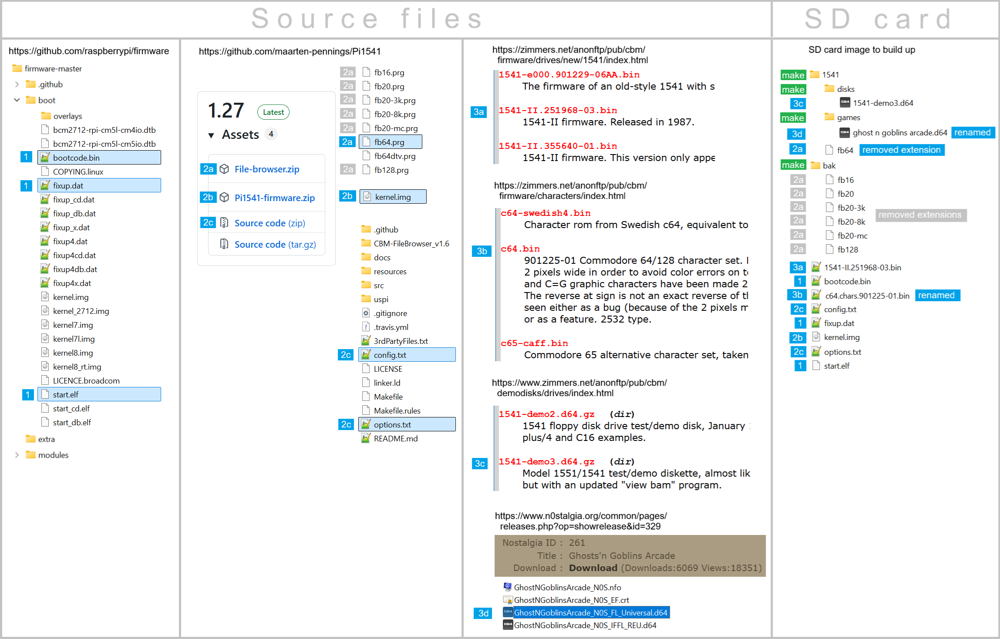

# SD card

This page described in more detailed how to create an SD card image.
It also includes technical details of why each file is needed.

## Setup SD card

Preparing the SD card for the Raspberry Pi means merging files from different sources.

There are three sources:

- The [GitHub from the Raspberry Pi foundation](https://github.com/raspberrypi/firmware) 
  supplies the Pi's bootloader files.

- The GitHub [repo](https://github.com/pi1541/Pi1541) with the firmware from Steve White, 
  or my [fork](https://github.com/maarten-pennings/Pi1541) supplies the Pi1541 firmware and its
  options file and a filebrowser.

- Zimmers for [1541 roms](https://zimmers.net/anonftp/pub/cbm/firmware/drives/new/1541/index.html), [character roms](https://zimmers.net/anonftp/pub/cbm/firmware/characters/index.html)
  or [demo disks](https://zimmers.net/anonftp/pub/cbm/demodisks/drives/index.html).
  Nostalgia supplies [Ghosts'n Goblins Arcade](https://www.n0stalgia.org/common/pages/releases.php?op=showrelease&id=329) to to test the hex inverter quality.

The infographic below shows the required contents of the SD card (right side, blue numbered tags);
the left three columns show where to find each item (same blue numbered tags).

This repo includes a prepackaged [SD card image](pi1541sdcard.zip);
download it, unzip it and place in the root of a FAT formatted SD card 
(the file `kernel.img` must be in the root of the SD card).

> WARNING the SD card image has my kernel V1.27.

> WARNING every kernel needs to be configured via `options.txt`.
> Configuration includes (but is not limited to) which OLED is on your PCB, 
> which GPIO pins do the buttons use, what is the name of the file that 
> contains the drive rom, do you want sound.

> WARNING the `options.txt` on the SD card matches my PCB and my choices.

## Background

This section explains why all those files are needed.
Feel free to skip.

### Raspberry Pi foundation

It seems that on a Raspberry Pi (up to version 3), the GPU takes care of the boot process.
When the Raspberry Pi powers on, the bootloader burned directly into the hardware (ROM) wakes up. 
It only knows how to look for a file named `bootcode.bin` on an SD card with FAT16 or FAT32.
We get boot files from [raspberrypi's GitHub](https://github.com/raspberrypi/firmware).

- The Bootloader `bootcode.bin` (50 kbyte). 
  This is the first code the Raspberry Pi’s GPU reads from the SD card (into the GPU's cache).
  It initializes the memory and prepares the system to load the GPU firmware.

- The GPU firmware `start.elf` (3 Mbyte) is the "operating system" for the GPU. 
  It reads `config.txt`, sets up the clocks, configures the display/HDMI, splits the RAM between the GPU and the CPU. 
  Finally, it loads your bare-metal binary `kernel.img` into RAM, and releases the ARM CPU from reset so it starts executing code.

- The memory map `fixup.dat` (7 kbyte) is a companion to `start.elf`.
  It contains configuration data partitioning the RAM between the GPU and the CPU, read by `start.elf`.

### Pi1541 firmware

We get the real firmware from [Pi1541.zip](https://cbm-pi1541.firebaseapp.com/Pi1541.zip) or my [fork](https://github.com/maarten-pennings/Pi1541).

- The firmware `kernel.img` (500 kbyte) is the default file the GPU (`start.elf`) 
  looks for to start the main processor (ARM CPU). This name usually points to the Linux kernel but it can 
  be any compiled binary. The _Pi1541_ is a bare metal firmware. This means that the code runs
  directly on the hardware without an underlying operating system (no scheduler, no file system).

  Steve's latest greatest (v1.24) has some flaws like activity LED not working. 
  If you need the activity LED take an older versions at the bottom of this 
  [page](https://cbm-pi1541.firebaseapp.com/whatsnew.html#oldversions.:~:text=the%20wrong%20folder.-,Old%20Versions,-.).
  Alternatively, take  my [v1.27r](https://github.com/maarten-pennings/Pi1541).

- Configuration `config.txt` (41 byte) is read by `start.elf` (the GPU firmware), not `kernel.img`.
  It contains two lines.
  - `kernel_address=0x1f00000`  
    By default, the Raspberry Pi loads the kernel at address 0x8000 but the Pi1541 code is compiled for another address.
  - `force_turbo=1`  
    By default the Raspberry Pi clocks its CPU down when it is idle (dynamic frequency scaling). 
    This locks the CPU at its maximum rated speed constantly.
    The 1541 disk drive is a "real-time" device, it communicates with the C64 using fixed pulse widths.
    If the Pi would clock down, the pulse timings will shift, leading to communication errors.

- User options `options.txt` (6 kbyte) is written specifically for the Pi1541 
  emulator (which buttons, OLED type, how many IEC connectors, etc).

- The directory `1541` is the root directory for the "disks" served by the firmware.
  It contains (will later contain) disk images (`.d64`) files, 
  but it may also contain `PRG` files, i.e. C64 (or VIC-20, or ...) binaries 
  that the C64 can load directly from the Pi1541. 

  Since I only have a C64 I decided not to pollute my `1541` root directory with all 
  file browsers. I kept `fb64` and stored all others in `\bak`.

  I decided to remove the `.prg` extensions to make it more natural to load from C64
  (entering `LOAD"FB64",8` instead of `LOAD"FB64.PRG",8`). It is also wise to prevent 
  uppercase characters in `.prg` files on the SD card - they are hard to enter in C64.

### Commodore binaries

You need commodore binaries.
If you have VICE on your system, you already have them
Alternatively, download them from Zimmers: 
[drive roms](https://www.zimmers.net/anonftp/pub/cbm/firmware/drives/new/1541/index.html) 
or [font roms](https://zimmers.net/anonftp/pub/cbm/firmware/computers/c64/index.html)

- `1541-II.251968-03.bin`
  You need Commodore binaries that run on the disk drive.
  I kept it simple and just have one binary: the latest greatest
  one used in the 1541-II.
  You have to configure the rom name in `options.txt`.

- `c64.chars.901225-01.bin`
  A fun aspect is that the OLED can use the C64 font (you have to 
  configure this in `options.txt`). If you enable this you also 
  have to install the C64 font on the SD card.
  You have to configure the font name in `options.txt`.

- `1541-demo3.d64`
  To have something to start with, the demo disk that 
  came with the original 1541 is stored in `disk`.

- `ghost n goblins arcade.d64`
  Another d64 image, of a game.
  This game includes a time critical fast loader.
  It is used as a benchmark for your Pi1541 implementation.

### Other files

Place any `prg` or `d64` file in (any subdirectory of) the `1541` 
directory (which is in the root of the SD card).

(end)

